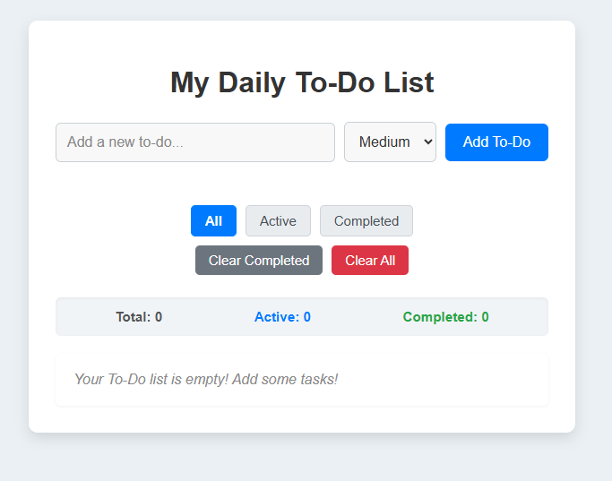
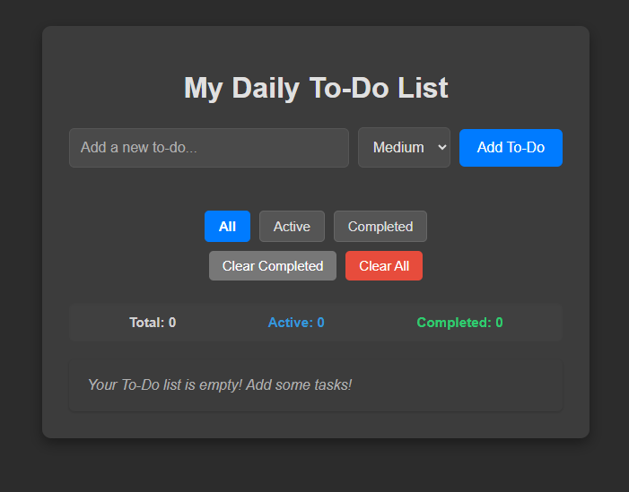

# My Daily To-Do List (Enhanced)

A feature-rich, interactive web application to manage your daily tasks. Built with vanilla HTML, CSS, and JavaScript, this To-Do List offers a seamless user experience with modern UI/UX enhancements and local data persistence.

## ✨ Features

Your To-Do List now comes packed with the following functionalities:

*   **Task Management (CRUD):**
    *   **Add New Tasks:** Quickly add new To-Do items with an intuitive input field.
    *   **Mark as Complete:** Toggle tasks as complete or incomplete with a clear visual indicator.
    *   **Delete Tasks:** Remove individual unwanted tasks with a confirmation prompt.
    *   **Edit Tasks:** Double-click on any task text to edit it directly in place.
    *   **Drag & Drop Reordering:** Easily reorder your tasks by dragging and dropping them into desired positions.

*   **Organization & Filtering:**
    *   **Task Priorities:** Assign `Low`, `Medium`, or `High` priority to your tasks for better organization, with distinct visual tags.
    *   **Task Filtering:** View tasks by `All`, `Active` (incomplete), or `Completed` status.
    *   **Bulk Clear Options:** Clear all `Completed` tasks or clear `All` tasks from your list (with confirmation).

*   **User Experience (UX) Enhancements:**
    *   **Local Storage Persistence:** All your tasks and preferences are saved locally in your browser, so they remain even after you close the tab.
    *   **Subtle Animations:** Enjoy smooth fade-in animations for new tasks and graceful fade-out animations for deletions, completions, and reorders.
    *   **Font Awesome Icons:** Modern and clear icons for complete and delete actions, enhancing visual appeal.
    *   **Inline Input Validation:** User-friendly error messages appear directly below the input field if you try to add an empty task.
    *   **Toast Notifications:** Get subtle, transient messages confirming successful actions (e.g., "Task added successfully!", "Task deleted!").
    *   **Task Counters:** Real-time display of total, active, and completed tasks for an at-a-glance overview.
    *   **Light/Dark Mode Toggle:** Switch between a light and dark theme with a single click, and your preference is remembered for future visits.

## 🚀 Technologies Used

*   **HTML5:** For the structural markup of the web application.
*   **CSS3:** For styling, layout (Flexbox), animations (`@keyframes`), and dynamic theming (`CSS Custom Properties`/Variables).
*   **JavaScript (ES6+):** For all the interactive logic, DOM manipulation, event handling, data persistence (`localStorage`), and drag-and-drop functionality.
*   **Font Awesome:** For scalable vector icons.

## 💻 How to Run It Locally

1.  **Clone the repository:**
    ```bash
    git clone https://github.com/dafingit.github.io/To-Do-List/
    ```
2.  **Navigate to the project directory:**
    ```bash
    cd my-todo-list
    ```
3.  **Open `index.html`:**
    Simply double-click the `index.html` file in your file explorer. It will open in your default web browser.

Alternatively, you can serve it with a simple local server (e.g., `Live Server` VS Code extension, or Python's `http.server`):
```bash
python -m http.server 8000
# Then open your browser to http://localhost:8000
Use code with caution.
Markdown

📸 Screenshot

Light Mode Example:

Dark Mode Example:


🛣️ Future Improvements (Ideas for Further Development)
Multi-User / Backend Integration: Transition from localStorage to a server-side backend with a database (e.g., Node.js with Express and MongoDB/PostgreSQL) to support multiple users and more robust data management.
Notifications API: Integrate browser's native Notification API for due dates or reminders.
Search Functionality: Add a search bar to quickly find tasks.
Task Attachments: Allow users to attach files or links to tasks.
Custom Color Palettes: Beyond light/dark, offer a selection of different color themes.
Accessibility Enhancements: Further improve keyboard navigation, screen reader support, and ARIA attributes.

🤝 Contributing
Feel free to fork this repository and contribute! If you have any suggestions or find a bug, please open an issue or submit a pull request.

📄 License
This project is open source and available under the MIT License.

Thank you for exploring this To-Do List application!